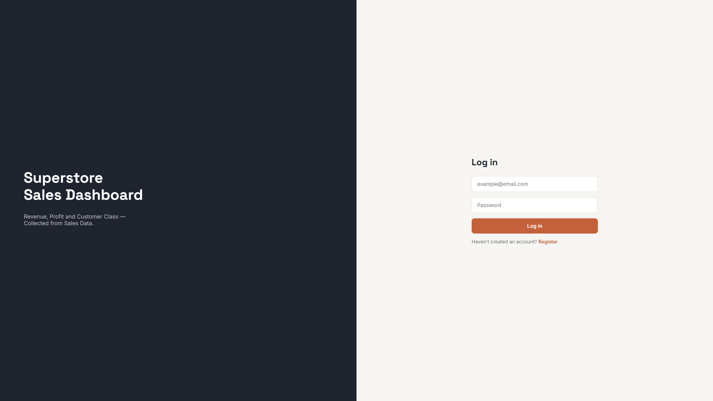
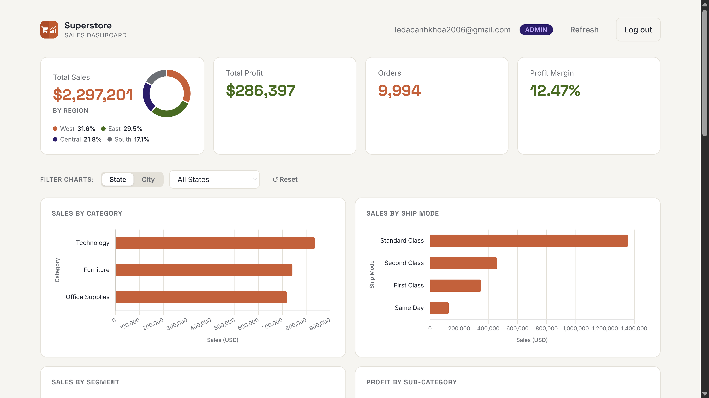
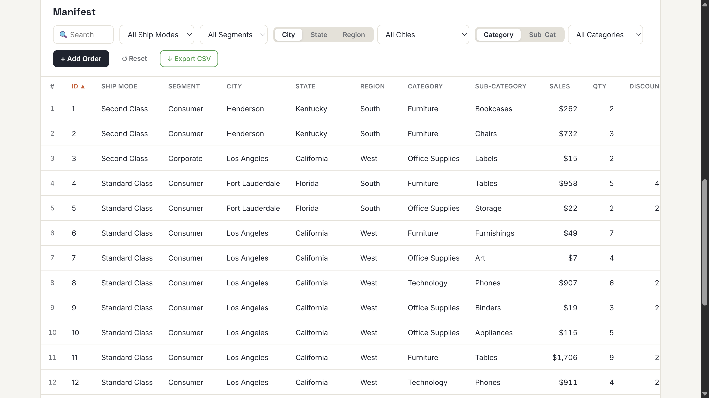

# Superstore Sales Dashboard

A full-stack web dashboard for analyzing superstore sales data — featuring authentication, interactive charts, a filterable data table, and admin order management.

Built with **FastAPI** (backend) and **vanilla HTML/CSS/JS** (frontend), backed by **PostgreSQL**.

---

## Dashboard Login

[](https://github.com/khoaanh101/superstore-dashboard)

---

## Dashboard

[](https://github.com/khoaanh101/superstore-dashboard)

[](https://github.com/khoaanh101/superstore-dashboard)

---

## Overview

| | |
|---|---|
| **Backend** | FastAPI · SQLAlchemy async · Pydantic v2 · PostgreSQL 16 · Alembic |
| **Auth** | JWT (access + refresh token rotation) · bcrypt · RBAC (viewer / admin) |
| **Frontend** | Vanilla HTML/CSS/JS · Chart.js · modular CSS · ES modules |
| **Infra** | Docker · Docker Compose · pytest · SQLite in-memory tests |

**Features:** JWT auth with refresh token rotation · RBAC (viewer/admin) · KPI cards · interactive + filterable charts · paginated & sortable data table · CSV export · admin order CRUD · skeleton loaders · auto token refresh

---

## Getting Started

### Prerequisites

- [Docker](https://docs.docker.com/get-docker/) & Docker Compose

### 1. Configure environment

```bash
cp .env.sample .env
```

Edit `.env` and set at minimum:

```env
JWT_SECRET=your-random-secret-key
# Generate: python -c "import secrets; print(secrets.token_hex(32))"
```

### 2. Start the full stack

```bash
docker compose up -d
```

This builds and starts:
- **FastAPI** on `http://localhost:8000`
- **PostgreSQL** on port `5432`
- **pgAdmin** on `http://localhost:5050`

### 3. Import sales data

Open pgAdmin at `http://localhost:5050` and import the Superstore dataset CSV into the `superstore_sales` table.

> **Note:** Database migrations run automatically on container startup via `scripts/entrypoint.sh`.

---

## Running Tests

### Backend (pytest)

Tests run on an in-memory SQLite database — no PostgreSQL required.

```bash
# Run all backend tests
uv run pytest

# Run with verbose output
uv run pytest -v

# Run a specific test file
uv run pytest backend/tests/test_auth.py -v
uv run pytest backend/tests/test_chart.py -v
uv run pytest backend/tests/test_orders.py -v
uv run pytest backend/tests/test_query.py -v
uv run pytest backend/tests/test_schemas.py -v
uv run pytest backend/tests/test_security.py -v
```

---

## Expose locally with ngrok (optional)

[ngrok](https://ngrok.com/) lets you share your local server over the internet — without deploying or exposing any secret keys.

### 1. Install ngrok

```bash
# Windows (winget)
winget install ngrok

# macOS (Homebrew)
brew install ngrok/ngrok/ngrok
```

### 2. Authenticate (one-time)

Sign up for a free account at [ngrok.com](https://dashboard.ngrok.com/signup), then run:

```bash
ngrok config add-authtoken <YOUR_AUTHTOKEN>
```

### 3. Start the full stack

```bash
docker compose up -d
```

### 4. Open a tunnel in another terminal

```bash
ngrok http 8000
```

ngrok will print a public URL like:

```
Forwarding  https://abc123.ngrok-free.app -> http://localhost:8000
```

Share that URL with anyone — they can access your dashboard without needing your `.env` or database credentials.

> **Note:** The free tier generates a new random URL each time. To get a fixed subdomain, upgrade to a paid ngrok plan.

---

## Interactive API Documentation

Full interactive docs available at `http://localhost:8000/docs`.

---

## Environment Variables Reference

| Variable | Required | Default | Description |
|---|---|---|---|
| `DATABASE_URL` | ✅ | — | Async PostgreSQL connection string (`postgresql+asyncpg://...`) |
| `JWT_SECRET` | ✅ | — | Secret key for signing JWTs |
| `JWT_ALGORITHM` | ❌ | `HS256` | JWT signing algorithm |
| `JWT_EXPIRES_MINUTES` | ❌ | `60` | Access token lifetime (minutes) |
| `REFRESH_TOKEN_EXPIRES_DAYS` | ❌ | `7` | Refresh token lifetime (days) |
| `CORS_ORIGINS` | ❌ | `*` | Comma-separated allowed CORS origins |
| `DEBUG` | ❌ | `false` | Enable FastAPI debug mode |
| `PG_USER` | ❌ | `postgres` | PostgreSQL user (Docker Compose) |
| `PG_PASSWORD` | ❌ | `yourpassword` | PostgreSQL password (Docker Compose) |
| `PG_DATABASE` | ❌ | `superstore_sales` | PostgreSQL database name (Docker Compose) |
| `PG_PORT` | ❌ | `5432` | PostgreSQL exposed port (Docker Compose) |
| `PGADMIN_EMAIL` | ❌ | `demo@example.com` | pgAdmin login email (Docker Compose) |
| `PGADMIN_PASSWORD` | ❌ | `secret` | pgAdmin login password (Docker Compose) |

---

## License

This project is licensed under the terms of the MIT license.
